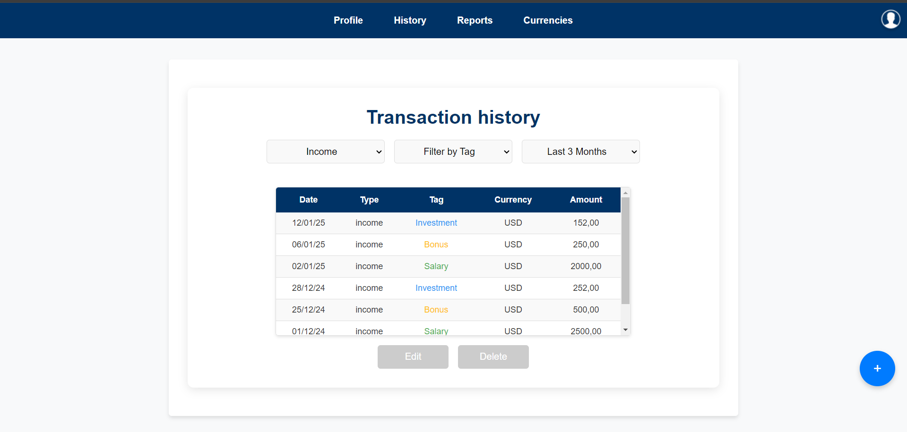
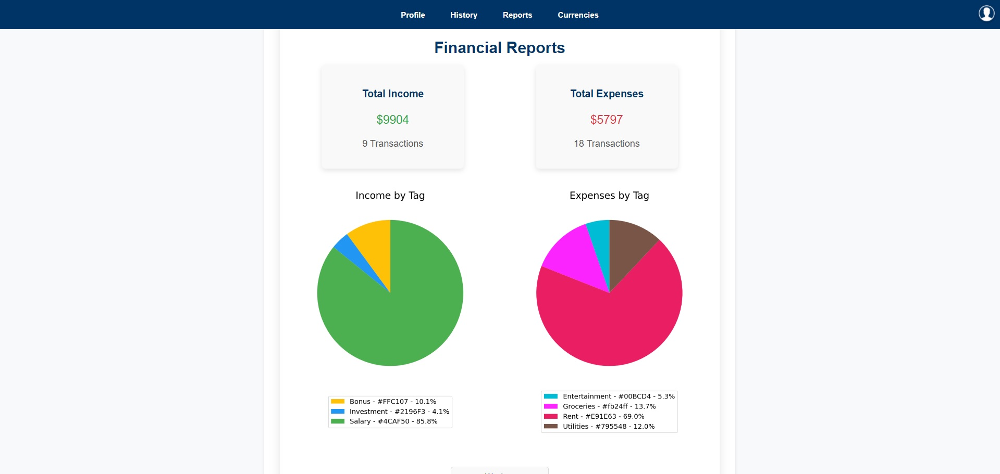
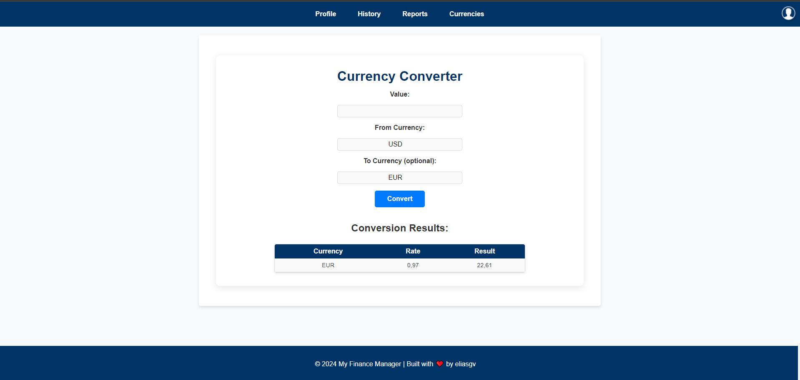

# Finance Manager

**Finance Manager** is a personal finance management application that allows users to record, organize, and analyze their financial transactions efficiently. With an intuitive interface, advanced tools like a real-time currency converter, and detailed financial analysis graphs, **Finance Manager** will help you take full control of your finances.

## Features

- **User Registration and Personalized Profile**: Users can register, log in, and personalize their profile by choosing the main currency they will use and optionally entering an initial balance.
- **Customizable Tags**: Users can create and edit custom tags to organize and classify their transactions according to their needs.
- **Transaction Recording**: Users can easily record income and expenses.
- **Currency Converter**: Convert values between over 160 currencies in real time.
- **Financial Analysis**: View detailed statistics and graphs for a deep analysis of your financial movements.
- **Interactive Graphs**: Use libraries like **Plotly** and **Matplotlib** to generate interactive graphs and detailed visualizations.
- **Transaction History Management**: Users can review, edit, and delete their recorded transactions.
- **User-Friendly Interface**: Developed with an intuitive interface in HTML and CSS for easy navigation.

## Technologies

- **Backend**: Python with Django
- **Frontend**: HTML, CSS
- **Graphs**: **Plotly**, **Matplotlib**
- **Data Management**: **Pandas**
- **Currency Conversion API**: Uses an API to get real-time exchange rates.

## Usage Flow

1. **Register and Log In**: The first step is to register for the app or log in if you already have an account.
2. **Profile Setup**: It is recommended to set up your profile immediately, where you can:
   - Choose your **main currency**.
   - Enter an **initial balance** (optional).
   - Customize your **tags** to classify transactions according to your needs.
   These settings can be edited at any time from the profile.
3. **Recording Transactions**: Once your profile is set up, you can start recording your income and expenses. To do this, click on the **blue button** that appears at the bottom of your screen and complete the form with the relevant details.
4. **Transaction History**: Access your recorded transaction history where you can:
   - View, edit, and delete previous transactions.
   - Check your **statistics** and **graphs** in the **Reports** section.
5. **Currency Converter**: Use the **currency converter** tool to perform conversions between over 160 currencies in real time.

### Example Screenshot

   

## Installation

1. Clone this repository to your local machine:
   ```bash
   git clone https://github.com/your_username/finance_manager.git
   ```
2. Navigate to the project directory:
    ```bash
   cd finance_manager
    ```  
3. Create a virtual environment (if you don't have one already):
    ```bash
    python -m venv venv
    ```
4. Activate the virtual environment:
   
      -On Windows:
      ```bash
      venv\Scripts\activate
      ```
      -On macOS/Linux:
      ```bash
      source venv/bin/activate
      ```

6. Install the necessary dependencies:
   ```bash
   pip install -r requirements.txt
   ```
7. Run database migrations:
   ```bash
   python manage.py migrate
   ```
8. Run the development server:
   ```bash
   python manage.py runserver
   ```
9. Open your browser and visit:
   ```bash
   http://127.0.0.1:8000/
   ```
